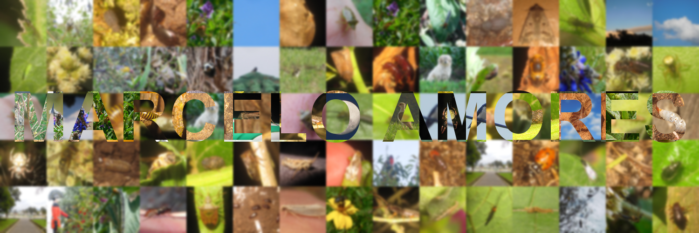

# Bienvenid\@ a mi página de GitHub

## Acerca de Mí

¡Hola! Mi nombre es Marcelo, soy un apasionado por las ciencias naturales y la tecnología. Este espacio es una recopilación de mis proyectos, investigaciones y recursos que he creado o en los que he colaborado. Mi objetivo es contribuir al desarrollo de herramientas y estrategias innovadoras que hagan la ciencia, su aprendizaje y comunicación más accesibles.

## Contacto

Si tienes preguntas, sugerencias o simplemente quieres charlar sobre educación, tecnología o ciencias, ¡no dudes en contactarme!

Puedes encontrarme en:

-   **Correo electrónico**: [contacto.envinatu@gmail.com](contacto.envinatu@gmail.com)

-   **LinkedIn**: [Marcelo Amores](https://www.linkedin.com/in/marceloamores/)

-   **Twitter**: [\@nvinatu](https://twitter.com/nvinatu)

------------------------------------------------------------------------
Cuando no estoy por aquí, me encuentro observando biodiversidad.

<a href="[https://www.inaturalist.org/observations/marceloamores](https://www.inaturalist.org/people/1116633)" target="_blank" style="text-decoration: none;">
  
  <strong>Mira mis observaciones en iNaturalist »</strong>
</a>

------------------------------------------------------------------------

Gracias por visitar mi página, ¡espero que encuentres algo interesante aquí!
